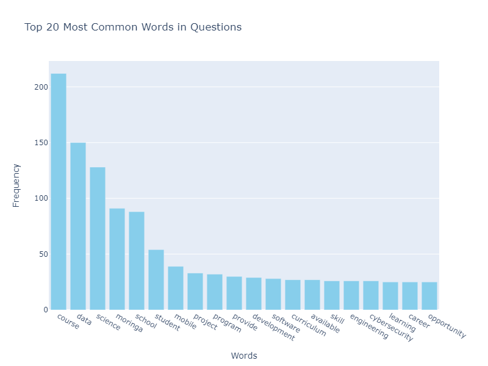
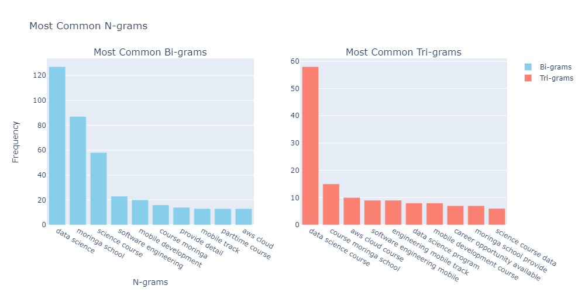
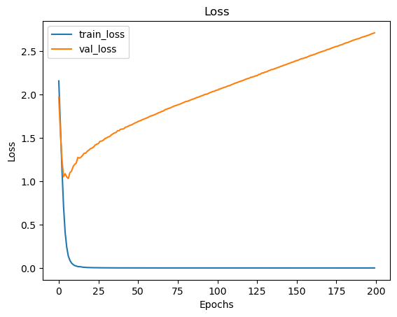
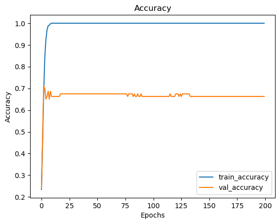
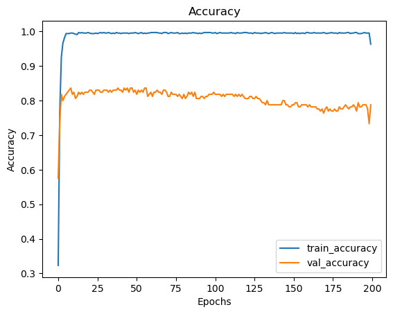
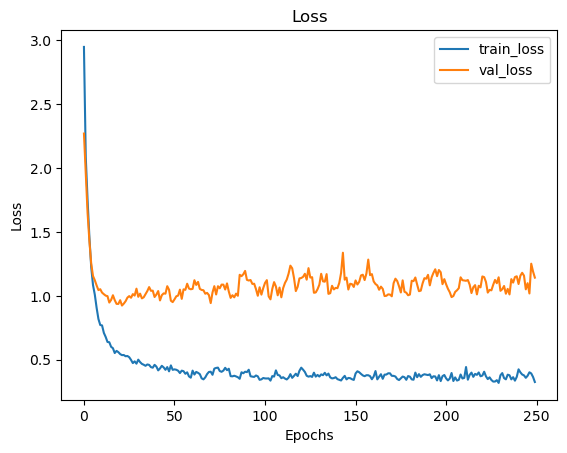
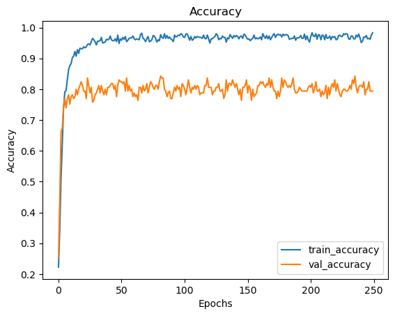
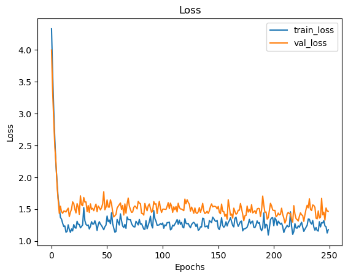
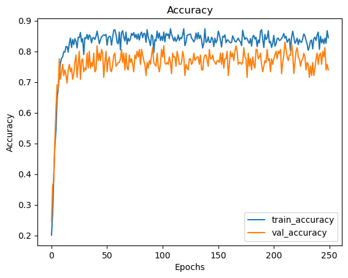
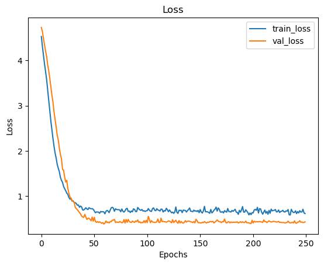

# Capstone Project

***

***

## Moringa-AI-Chatbot
AI Chatbot for Moringa School

**Authors**: 
* Fredrick Kyeki
* Angela Nyaga
* Mark Kimanthi
* Peninah Gituku
* Dennis Mutuku
* Samuel Gichaga
* Kelvin Muia

### Contents
- [Overview](#overview)
- [Business Understanding](#businessunderstanding)
- [Business Problem](#businessproblem)
- [Objectives of the Chatbot](#objectivesofthechatbot)
- [Data Understanding](#dataunderstanding)
- [Data Preparation](#datapreparation)
- [Exploratory Data Analysis (EDA) ](#exploratorydataanalysis(EDA))
- [Modeling](#modeling)
- [Evaluations](#evaluations)
- [Conclusions and Recommendations](#conclusionsandrecommendations)

  ***
## Overview
The primary objective of this project is to develop an **AI chatbot for Moringa School's website**. The chatbot aims to understand user queries, connect users to key information about courses and enrollment, and provide technical support for any issues faced by visitors. The chatbot will leverage **Natural Language Toolkit (NLTK)** for natural language processing, ensuring a comprehensive understanding of user inquiries.

***
## Business Understanding
The adoption of chatbots is on the rise, with the project anticipating that by the end of 2030, over 75% of customer queries will be resolved by chatbots. Companies are increasingly using chatbots to boost efficiency by automating recurring queries, providing quick customer assistance, and enhancing customer experience by reducing wait times and offering 24/7 support. In the education sector, this project falls under the category of "service-oriented chatbots," designed to answer FAQs and provide general information.

***
## Business Problem
Moringa School, a learning accelerator in Nairobi, Kenya, has experienced substantial growth, training over 2000 students globally since its inception in 2014. With a goal to train over 200,000 students by 2030 and new course launches, the demand for Moringa School's services is expected to increase. The current modes of accessing Moringa services, such as visiting the website or making calls, may not efficiently cater to the growing demand. The business problem is to bridge this gap by employing a chatbot to provide fast, 24/7 service, improve customer experience, offer access to information, and provide technical support.

***
## Objectives of the Chatbot

* **Provide Fast, 24/7 Service**: The chatbot will ensure round-the-clock support, especially during peak hours, peak seasons, or for international students in different time zones, reducing wait times when human assistants are unavailable.

* **Improve Customer Experience**: Welcoming users to the website and offering navigation assistance, the chatbot will enhance the overall user experience by providing efficient links to specific resources.

* **Provide Access to Information**: Users can inquire about general information, such as courses offered, admission procedures, tuition fees, and events. The chatbot will provide details, schedules, and registration information for events.

* **Offer Technical Support**: The chatbot will address technical issues users may face on the website, guiding them through troubleshooting steps or redirecting them to relevant resources.

* **Data Collection for Learning**: As the chatbot assists users, it will collect data on user queries, frequently asked questions and areas for improvement. This data will enable the chatbot to learn, providing more accurate and personalized responses over time. The chatbot will improve its ability to discern which queries it can handle autonomously and which may require human assistance.

***
## Data Understanding

* **Source of Data**: The project obtained data by scraping Moringa School's websites, employing two Python scripts: link_scraper.py and web_scraper.py.

1. Link Scraper**: Utilizes BeautifulSoup to extract hyperlinks from Moringa School's website pages, saving the links to a JSON file named scraped_links.json.

2. Web Scraper**: Utilizes links from scraped_links.json to extract text content from corresponding web pages. Text data is then saved in moringa_text_corpus.json.

* **Data Files**:

* **scraped_links.json**: Contains unique URLs obtained during link scraping.
* **moringa_text_corpus.json**: Stores text content in a structured format, associating each link with a list of unique text snippets.

***
## Exploratory Data Analysis (EDA)
**Objectives**:

* Thoroughly examine the dataset of intents, questions, and responses.
* Understand the distribution and nature of the data.
* Identify patterns and uncover insights to guide the AI Chatbot development.
**Key Areas of Analysis**:

* Diversity of intents.
* Structure and length of questions and responses.
* Common themes and word frequencies.

**Intent distribution**

**Findings**
* In the dataset, there are a total of 10 unique intents, each representing a specific category or topic.
* On average, each intent contains approximately 52.40 questions. This statistic provides insight into the typical number of questions associated with each intent.
* The median number of questions per intent is 30. This means that half of the intents have 30 or fewer questions, while the other half contains more than 30 questions. The median helps us understand the central tendency of question counts.

**Question and Response Length Analysis**

**Findings**
* The blue bars (questions) are clustered more towards the left side of the graph, indicating that most questions are shorter in length. The tallest blue bar, indicating the highest frequency, falls in the range of 0-10 words approximately.
* The red bars (responses) show a wider distribution across the word count, suggesting that responses have a more varied length. The tallest red bar is in the range of 10-20 words.
* The blue bars (questions) have a peak frequency much higher than the red bars (responses), suggesting that there is a common word count range where most questions fall.

**Word Frequency Analysis**

**Findings**
* The analysis provides insights into the key themes and topics present in the dataset.
* The most common words reflect a strong emphasis on courses, data science, Moringa, and educational aspects.
* With 'course' being the most frequent word, the dataset places a substantial emphasis on educational offerings.
* 'data,' 'science,' and 'moringa' indicate a strong focus on data science education, aligning with industry and institutional themes.
* The repetition of terms like 'student,' 'develop,' and 'learn' underscores a learner-centric approach in the dataset.
**Bi-grams and Tri-grams Analysis**

**Findings**

* On the left, the bi-grams bar chart shows that "data science" is the most frequent bi-gram, followed by "moringa school" and others.
* On the right, the tri-grams bar chart indicates "data science course" as the most frequent tri-gram, with a notable drop in frequency for subsequent tri-grams

***
## Modeling

**Base Model Performance**

**Findings**
*The base model demonstrates a high training accuracy of approximately 98%, suggesting effective learning from the training data*.
*However, a significant performance gap is observed, with the validation accuracy plateauing at 30-40%, raising concerns about overfitting*.
*The validation loss notably increases in later epochs, reaching around 9.8, further reinforcing overfitting concerns*.
*To address these issues, recommendations include incorporating both questions and responses in the training data for a more comprehensive understanding, implementing regularization techniques to mitigate overfitting, and exploring performance improvement measures such as learning rate tuning and optimizing hidden layers*.
*Additionally, testing different vectorization methods like TFIDF and embeddings is suggested, with the option to consider alternative deep learning models if necessary*.

**Train on both questions and responses**

**Findings**
*The model exhibits notable improvement, with training accuracy at approximately 99.42% and validation accuracy at around 58.78%*.
*Despite this progress, there is potential for further enhancement in the validation accuracy*.

**Regularization - Dropout regularization**

**Optimize the number of hidden layers:**

**Term Frequency * Inverse Document Frequency (TFIDF) vectorization**

***

## Evaluation

***
## Conclusions and Recommendations

